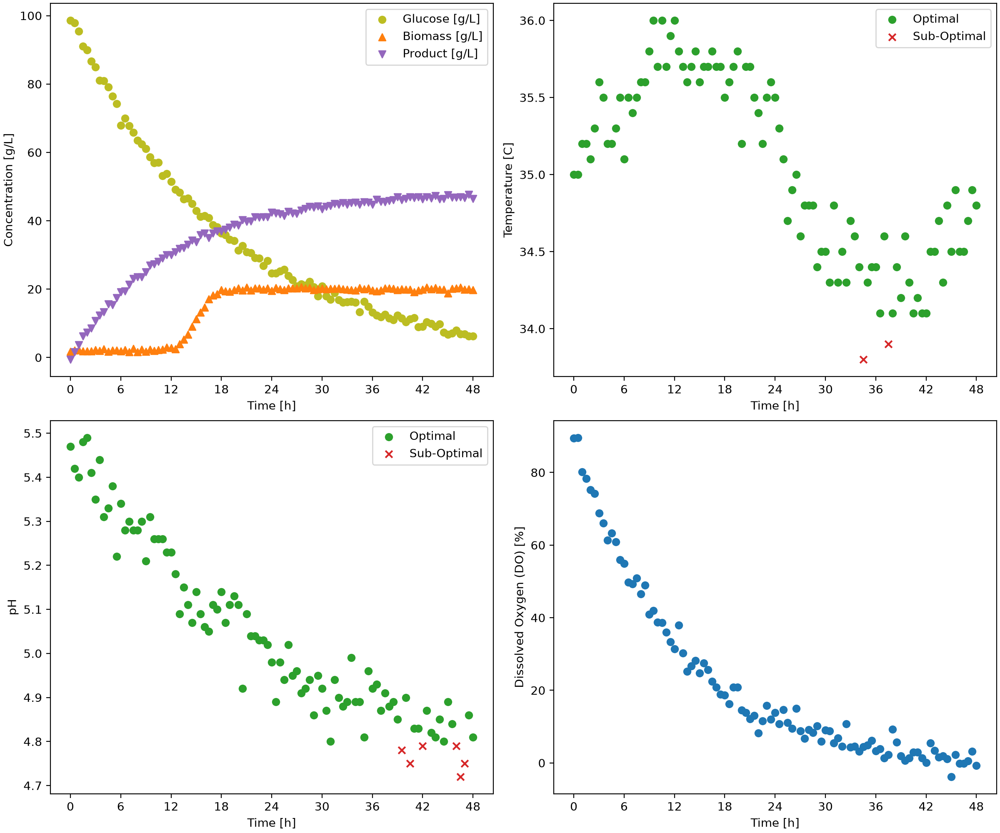

# Fermentation Process Monitor

This is an automated Python tool for monitoring fermentation batch process data, ensuring conditions remain within acceptable limits and produces dashboards and summary tables for further analysis.

---

## Overview

The primary objective of this project was to develop an automated system to analyze data for fermentation process runs. The system needed to be such that it can take batch datasets, track target parameters and discern whether the temperature and pH fall within their acceptable ranges.

## Features

The `BioprocessMonitor` class provides the following features:
- **Batch Extraction:** Extracted data is filtered by specific `batch_id`.
- **Measurement Masking:** Process identifies values of pH and Temperature within acceptable operating ranges using `optimal_ph_mask` and `optimal_temperature_mask`.
- **Generation of Dashboard:** Generates and exports a figure for any given batches which illustrates concentration, temperature, pH and dissolved oxygen percent over time.
- **Summary Table Creation:** Creates and exports batch-level summary tables which calculates the percent compliant for pH and temperature along with reporting the final product concentration of each batch.

## Technologies Used

- **Python** (v3.14.7)
- **pandas** (v3.0.6)
- **matplotlib** (v3.11.0)
- **numpy** (2.5.2)

## Code Design

When `main.py` is run, the following actions occur:
1. The operating condition constraints, `ph_lims` and `temperature_lims` are defined for operational mode A and B.
2. The fermentation batch dataset .csv file is loaded and made compatible.
3. The `BioprocessMonitor` is called for each operational mode.
4. For each unique `batch_id` in the dataset, dashboard figures are built and exported to `figures`.
5. Calculated batch parameters are exported in a summary table for each mode in a .csv file found under `tables`.

---
## Dashboard

The dashboard figure provides a visual breakdown of a single fermentation batch over time:

- **Concentrations:** This subplot is found in the Top-left. It tracks the glucose, biomass and product concentrations ($g/L$) over time ($h$).
- **Temperature:** Located in the Top-Right corner of the dashboard, this subplot plots the temperature ($\circ C%=$) against time ($h$) while highlighting optimal and suboptimal values.
- **pH:** This subplot is located in the Bottom-left and illustrates the pH levels as a function of time ($h$) while differentiating between optimal and suboptimal values.
- **Dissolved Oxygen:** Located in the Bottom-right, this plot illustrates the dissolved oxygen percentage (%) against time ($h$).

An example of a generated dashboard is found below:

---

## Summary Table

The summary table aggregates target data across all batches for each operational mode

- `batch_id`: The unique identification number assigned to each batch.
- `ph_optimal_percent`: The percentage of pH measurements in a batch within the acceptable pH range, rounded to 2 decimals.
- `temperature_optimal_percent`: The percentage of temperature measurements in a batch within the acceptable temperature range, rounded to 2 decimals.
- `C_product_g_L^-1_final`: The final product concentration of a batch.

An example summary table is found below:

| batch_id | ph_optimal_percent | temperature_optimal_percent | C_product_g_L^-1_final |
|----------|--------------------|-----------------------------|------------------------|
| 1        | 93.81              | 97.94                       | 46.5                   |
| 2        | 96.69              | 97.52                       | 50.8                   |
| 3        | 95.89              | 93.15                       | 44.6                   |
| 4        | 100.0              | 96.47                       | 48.6                   |
| 5        | 48.62              | 99.08                       | 24.7                   |